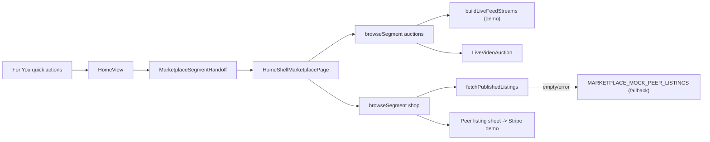

# Marketplace — Auctions & Shop

This document maps how the marketplace tab serves two distinct experiences inside a single surface: **Auctions** (live demo streams) and **Shop** (peer listings). It covers state, handoffs, data sources, and key components so future changes do not conflate them.

## Single surface, two segments

Both experiences render inside [`HomeShellMarketplacePage`](../src/components/HomeShellMarketplacePage.tsx) when `subView === 'browse'`. A `browseSegment: 'auctions' | 'shop'` flag selects which grid + category strip is shown above a shared search/wallet/cart header.

| Segment | Grid | Detail surface |
| --- | --- | --- |
| `auctions` | `LiveFeedCard` thumbnails (live pill + viewers) | [`LiveVideoAuction`](../src/components/LiveFeedPage.tsx) overlay |
| `shop` | `MarketplacePeerListingGridCard` | Peer listing sheet → demo Stripe checkout |

## State (inside `HomeShellMarketplacePageInner`)

| State | Purpose |
| --- | --- |
| `subView: 'browse' \| 'cart' \| 'checkout' \| 'orderComplete'` | Top-level mode of the marketplace tab. |
| `browseSegment: 'auctions' \| 'shop'` | Which grid is shown when `subView === 'browse'`. |
| `liveCategory` / `listingCategory: LiveFeedCategory` | Selected category chip per segment. |
| `peerListFilter` | Search query, category, max price ceiling, scope — applied to both server query and client filter. |
| `activeLiveStream` | When set, `LiveVideoAuction` portal is mounted. |
| Sorting state (added) | `listingSort` / `auctionSort` — see Sorting below. |

## Handoffs

`HomeShellMarketplacePage` accepts deep-link style props from [`HomeView`](../src/views/HomeView.tsx) so other parts of the app can land users on the right segment with the right filters:

- `MarketplaceSegmentHandoff { id, segment }` — set by `openMarketplaceAuctionsEntry` / `openMarketplaceShopEntry`. Effect at the marketplace page applies it once per `id` and calls `onSegmentHandoffConsumed`.
- `MarketplaceBrowseHandoff` — pre-fills `peerListFilter` (category / q / maxPriceCents / scope).
- `dropsListingHandoff` / `dropsProductHandoff` — open a specific peer listing or supply product.

**Precedence:** segment handoffs always win on the frame they arrive (effect runs on a new `id`); persisted preference (see below) only seeds the initial state on cold start. This means a deep link to “Shop” cannot be overridden by a stale localStorage value.

## Data sources

- **Auctions** use `buildLiveFeedStreams()` from [`liveFeedDemo.ts`](../src/lib/liveFeedDemo.ts), which derives streams from `CURATED_DROP_REELS`. Filtering combines `liveCategory`, the shared search query (`peerListFilter.q`), and the synthetic `ending_soon` chip (matched against `tag`).
- **Shop** calls `fetchPublishedListings` from [`listingsApi`](../src/lib/listingsApi.ts) with server-side category/query, then applies `applyPeerListClientFilters` for `free`/category/maxPrice/q. If the API returns no rows, the client falls back to [`MARKETPLACE_MOCK_PEER_LISTINGS`](../src/lib/marketplaceMockPeerListings.ts) so the surface always has content.

## Cart vs peer listings (do not conflate)

The store cart (`cartQtyById`, `cartLines`, `placeStoreOrder`) belongs to the **supply catalog** (`SUPPLY_PRODUCTS`) and uses the store checkout API. Peer **listings** are individually purchased through `checkoutListing` in a separate sheet flow. The Shop segment never adds peer listings to the store cart.

## Sorting & filtering

Both segments share the search input and category chips. Each segment then exposes a **sort control**:

- **Shop:** `newest` (default — `createdAt` desc), `price_asc`, `price_desc`. Applied after `filteredPeerListingsForGrid`.
- **Auctions:** `viewers` (default — `watchers` desc), `ending_soon` (`endsInSec` asc), `price_low` (`priceCents` asc). Applied after `filteredLiveStreams`.

Shop also exposes preset **max price** chips that drive `peerListFilter.maxPriceCents`, which is already wired into both the server query and the client filter.

## Persistence

The selected `browseSegment` is persisted to `localStorage` under `fetch-mp-browse-segment` (lazy `useState` initializer + a small writer). Handoffs override storage on the frame they arrive (see Precedence above). Sort state is intentionally **not** persisted — it is a per-session preference that should not surprise users on return.

## Components

| Component | Role |
| --- | --- |
| [`HomeShellMarketplacePage`](../src/components/HomeShellMarketplacePage.tsx) | Top-level marketplace surface; owns segment, filters, cart, checkout. |
| [`LiveFeedCard` / `LiveVideoAuction`](../src/components/LiveFeedPage.tsx) | Auction grid tile and fullscreen viewer/bidding overlay. |
| `MarketplacePeerListingGridCard` (in `HomeShellMarketplacePage`) | Shop grid tile. |
| [`HomeShellBuySellPage`](../src/components/HomeShellBuySellPage.tsx) | Seller hub overlay (separate panel, not the public browse). |

## Known gaps / out of scope

- `buildLiveFeedStreams` is demo-only. A real live-stream API would replace it without changing the surface contract.
- Peer listing sheet checkout is demo-grade Stripe; production wiring is a separate concern.
- Merging the seller-hub `HomeShellBuySellPage` peer marketplace with this tab is a larger product decision.
